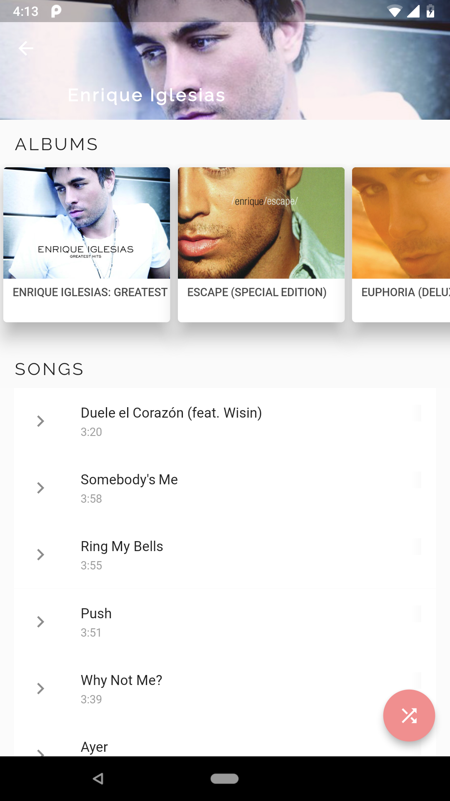

# Grey
A Material designed music player developed in Flutter
 
Download releases <a href="https://github.com/avirias/Grey/releases">here</a>.

# Screenshots
<table>
  <tr>
    <td>
      
       
      Now playing
    </td>
    <td>
      
       
      Home
      </td>
      <td>
      
         
      Home
      </td>
    </tr>
  <tr>
      <td>
      
         
      Album
      </td>
    <td>
      
       
      Album View
      </td>
      <td>
      
       
      Artist View
      </td>
    </tr>
    

  </table>

# Plugins
Music player plugin used : <a href="https://github.com/iampawan/Flute-Music-Player">Flute-music</a>

## Getting Started

For help getting started with Flutter, view our online
[documentation](https://flutter.io/).

