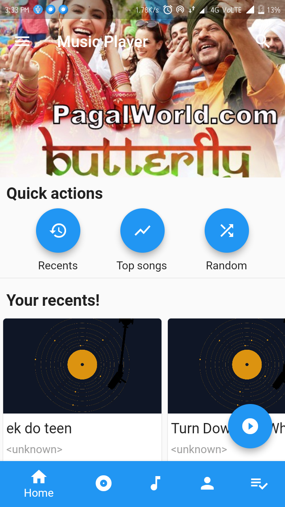
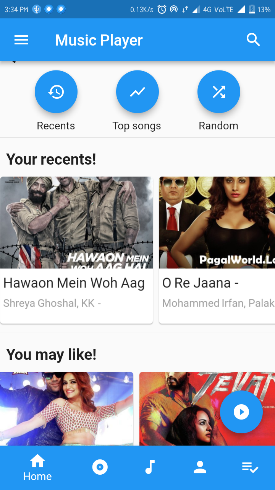
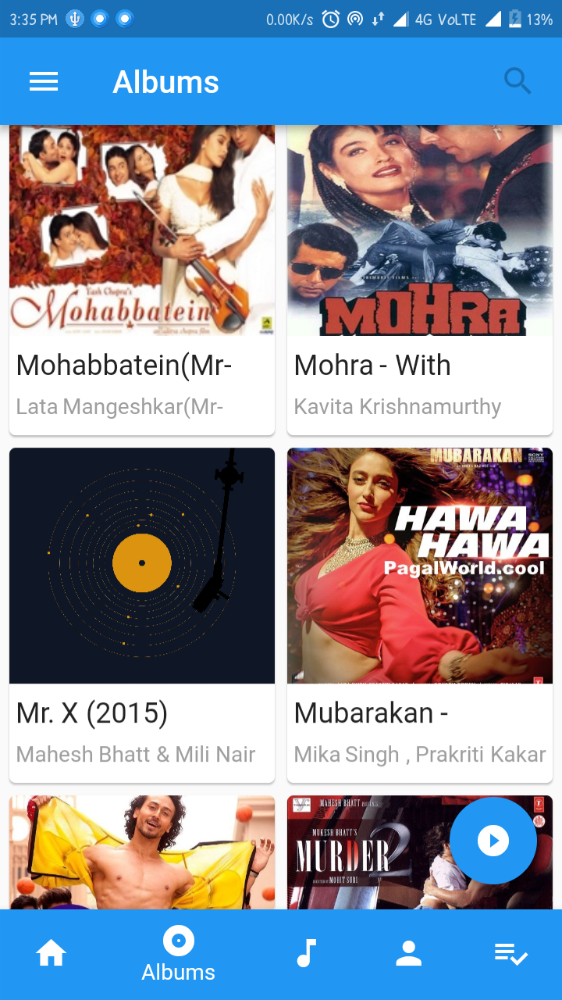
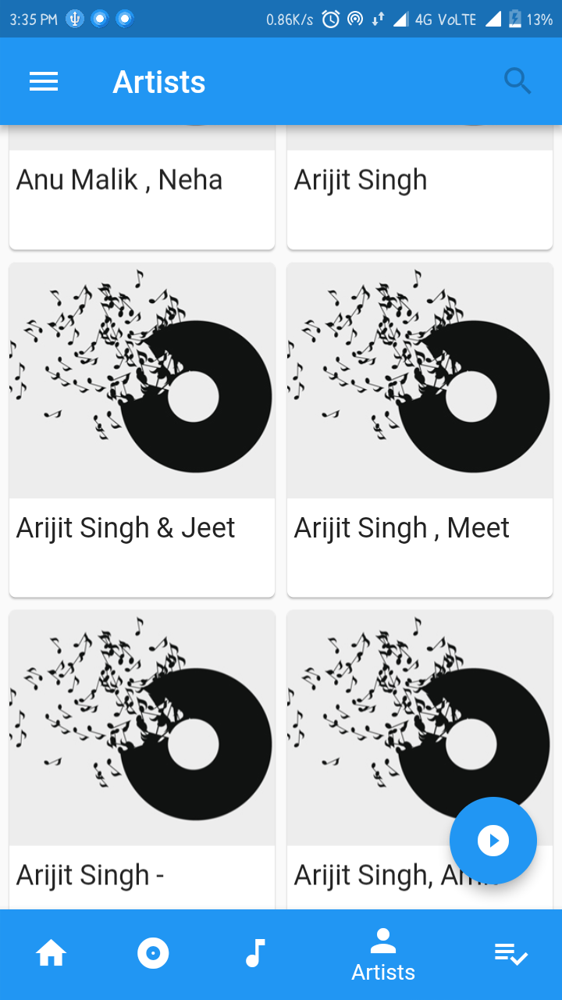
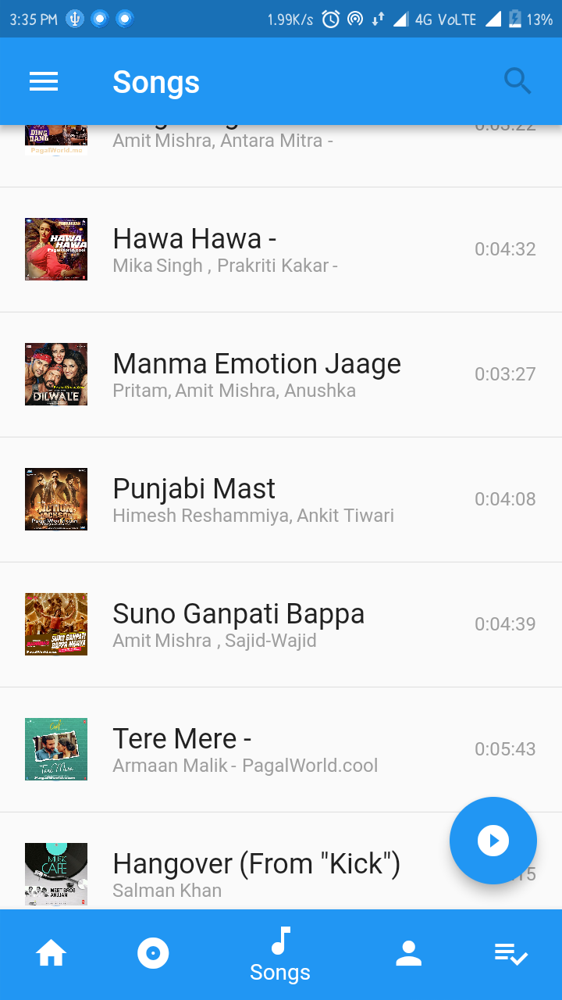
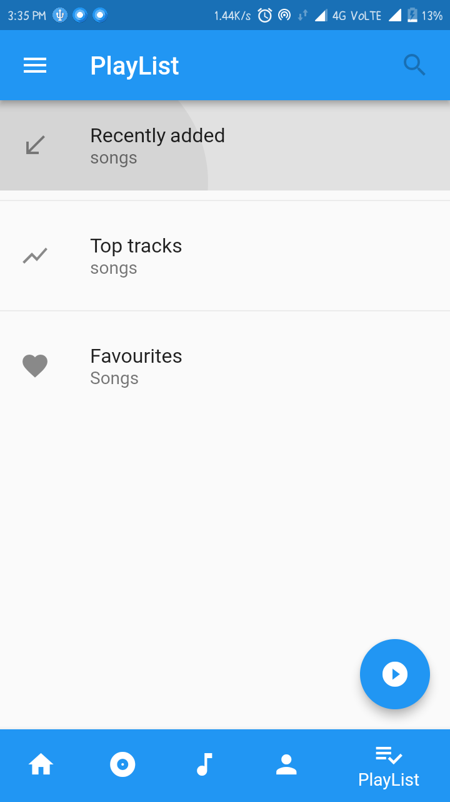
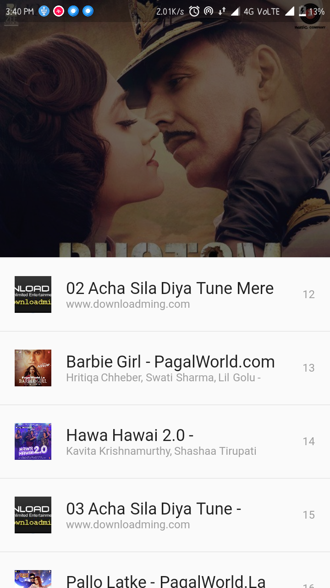
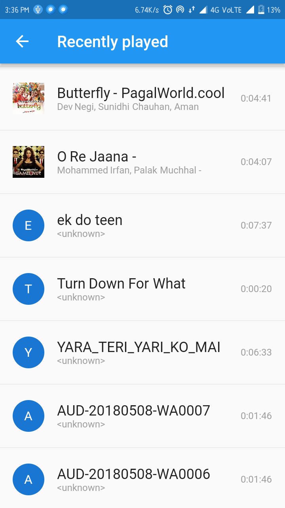
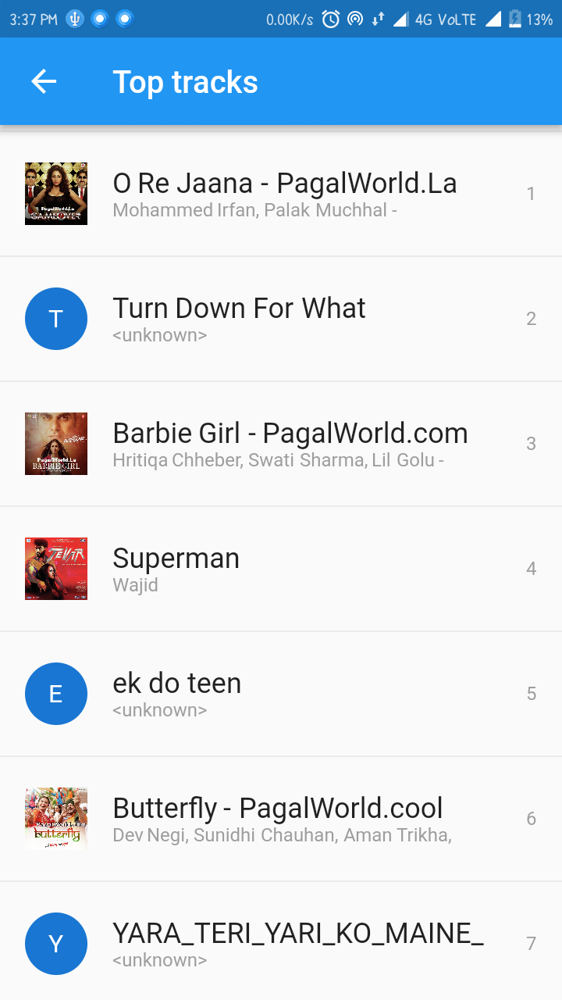

# Grey
Music Player developed in flutter
 
 
Download releases here <a href="https://github.com/avirias/Grey/releases">Music Player</a>.

# Screenshots
<table>
  <tr>
    <td>
      
      Now playing
    </td>
    <td>
      
      Home Screen
      </td>
      <td>
      
      Home Screen
      </td>
    </tr>
  <tr>
      <td>
      
      Album
      </td>
    <td>
      
      Artist
      </td>
      <td>
      
      Songs
      </td>
    </tr>
  <tr>
      <td>
      
     PlayList
      </td>
      <td>
      
      Queue
      </td>
      <td>
      
      Favourites
    </td>
    </tr>
  <tr>
      <td>
      
      Recently played
      </td>
      <td>
      
      Top tracks
      </td>
    <td>
      
      Landscape mode
    </td>
  </tr>
  </table>

# Plugins
Music player plugin used : <a href="https://github.com/iampawan/Flute-Music-Player">Flute-music</a>

## Getting Started

For help getting started with Flutter, view our online
[documentation](https://flutter.io/).

